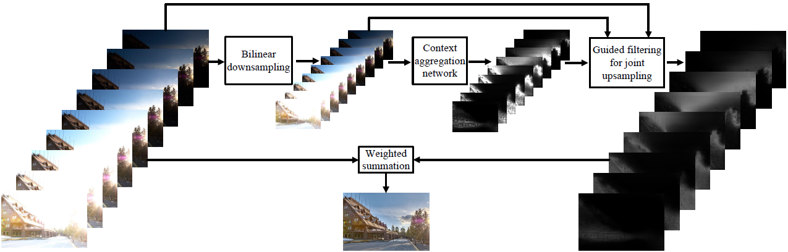

# Deep Guided Learning for Fast Multi-Exposure Image Fusion
This is the implementation for [Deep Guided Learning for Fast Multi-Exposure Image Fusion](https://ece.uwaterloo.ca/~k29ma/papers/19_TIP_MEF-Net.pdf),
[Kede Ma](https://kedema.org/), [Zhengfang Duanmu](https://ece.uwaterloo.ca/~zduanmu/), Hanwei Zhu, [Yuming Fang](http://sim.jxufe.cn/JDMKL/ymfang.html), 
[Zhou Wang](https://ece.uwaterloo.ca/~z07wang/), *IEEE Transactions on Image Processing*, to appear, 2019.

## Abstract
We propose a fast multi-exposure image fusion (MEF) method, namely MEF-Net, for static image sequences
of arbitrary spatial resolution and exposure number. We first feed a low-resolution version of the input sequence to a fully
convolutional network for weight map prediction. We then jointly upsample the weight maps using a guided filter. The final
image is computed by a weighted fusion. Unlike conventional MEF methods, MEF-Net is trained end-to-end by optimizing the
perceptually calibrated MEF structural similarity (MEF-SSIM) index over a database of training sequences at full resolution.
Across an independent set of test sequences, we find that the optimized MEF-Net achieves consistent improvement in visual
quality for most sequences, and runs 10 to 1000 times faster than state-of-the-art methods.

## MEF-Net Framework


## Prerequisites
The release version of MEF-Net was implemented and has been tested in Ubuntu 16.04 with
- Python = 3.6.2
- pytorch = 0.4.1
- torchvision = 0.2.1 


## Dataset
Please refer to the respective papers mentioned in the manuscript. We do not directly provide the large-scale dataset for MEF-Net.
We collect more than 1000 exposure sequence, and screening the local and non-aligned global motion sequences. 
Here, we provide only one exposure sequence "Corridor" to test training code. 

## Train
We recommend to use **GPU** to train the method:
```
python Main.py --train True --use_cuda True
```

## Test
Run the following command to test the exposure sequence "Corridor" with the default settings in MEF-Net on **GPU-mode**:
```
python Main.py --train False --use_cuda True --ckpt MEFNet_release.pt
``` 
on **CPU-mode**:
```
python Main.py --train False --use_cuda False --ckpt MEFNet_release.pt
``` 

## Reference

- K. Ma, K. Zeng, and Z. Wang, “Perceptual quality assessment for multi-exposure image fusion,” 
*IEEE Transactions on Image Processing*, vol. 24, no. 11, pp. 3345–3356, Nov. 2015.
- K. Ma, Z. Duanmu, H. Yeganeh, and Z. Wang, “Multi-exposure image fusion by optimizing a structural similarity index,” 
*IEEE Transactions on Computational Imaging*, vol. 4, no. 1, pp. 60–72, Mar. 2018.
- H. Wu, S. Zheng, J. Zhang, and K. Huang, “Fast end-to-end trainable guided filter,” in *IEEE Conference on Computer Vision and Pattern Recognition*, 2018, pp. 1838–1847.

## Citation
```
@aritcle{ma2019mefnet,
title={Deep Guided Learning for Fast Multi-Exposure Image Fusion},
author={Kede, Ma and Zhengfang, Duanmu and Hanwei, Zhu and Yuming, Fang and Zhou, Wang},
journal={IEEE Transactions on Image Processing},
year={to appear, 2019}
}
```

## Acknowledgment
The authors would like to thank Huikai Wu for his implementation of [Fast End-to-End Trainable Guided Filter](https://github.com/wuhuikai/DeepGuidedFilter) in Pytorch.